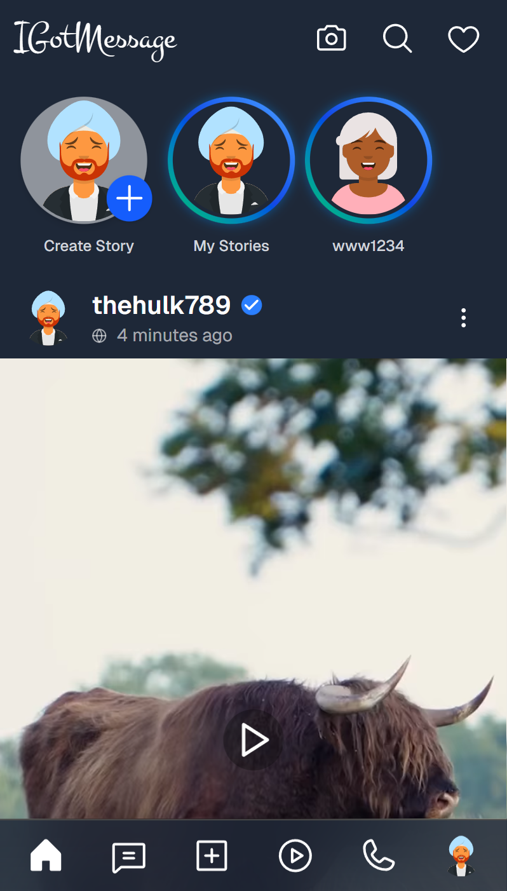
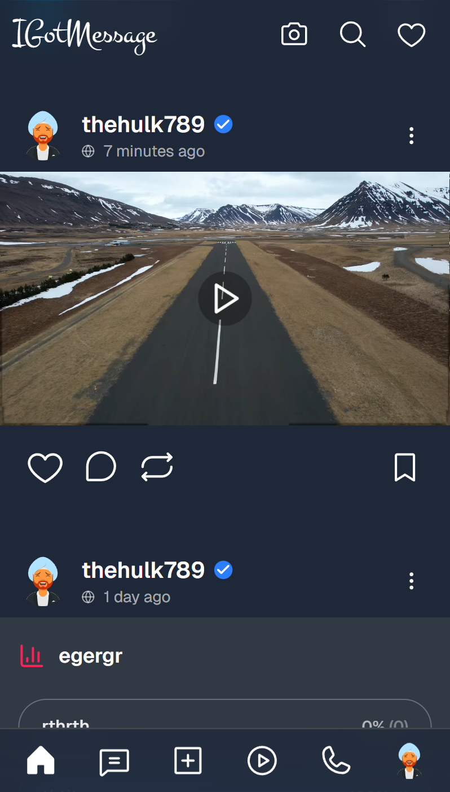
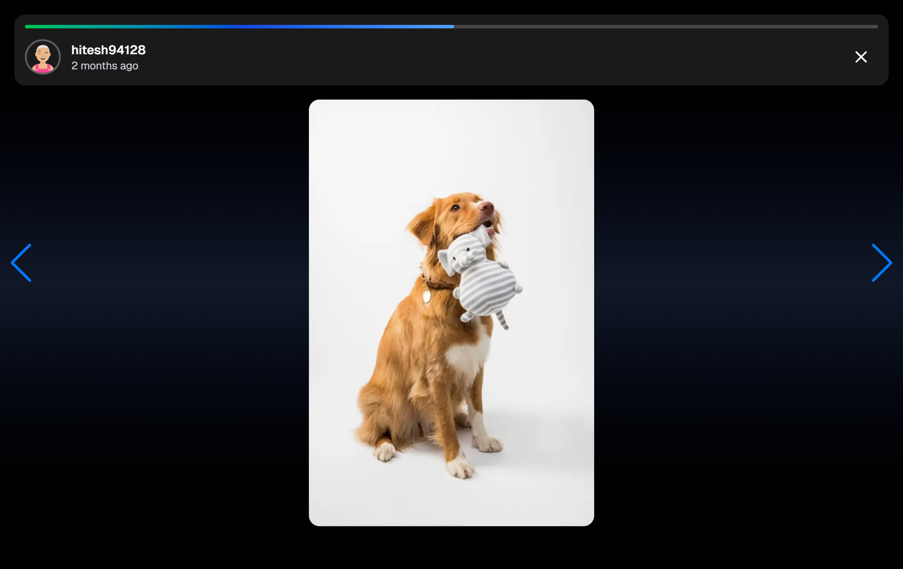

IGotMessage app link - https://igotmessage-app-frontend.vercel.app/

## 📸 App Screenshots

🏠 Home

    

📸 Stories

     

🎥 Reels

   

💬 Chat

     

🤖 AI Chat

   

🖋️ Create

   

🧑‍🏫 Profile

    

🔏 Auth

    

‼️ Error Handling

  

📞 Calls

🚧 Coming soon

🔔 Notifications

🚧 Coming soon

IGotMessage is an **indigenous, AI-powered next-gen social media platform** built with the vision of giving India its own digital stage.  
It’s not just a project to showcase my full-stack development skills — it’s a **Make in India initiative** to create a world-class platform where Indians can connect, share, and grow without relying on foreign tech giants.

Designed with **modern aesthetics, blazing-fast performance, and AI-driven innovation**, IGotMessage includes all the features people love — posts, stories, reels, chats, video calls, and more — while ensuring **privacy, inclusivity, and empowerment**.

# NextGen Social Media App

## 🚀 Features

- 📸 Stories with music integration
- 🎥 Reels feed with infinite scroll
- 💬 Real-time chat & video calls
- 🎁 Token-based reward system (ad-sponsored)
- 📷 AI-enabled stories and post generation
- 🔒 Secure authentication (cookies + token storage)
- ⚡ Optimized APIs with caching & rate limiting
- ⚡ ImageKit integration for smooth media experience
- ⚡ Aesthetic, modern and beautiful UI (better than other platforms)
- ⚡ Blazing fast speed in routing & interactions (powered by Next.js)

> **Note:** This is the web version of IGotMessage. Android and iOS apps are coming soon 🚀

## 🛠 Tech Stack

**Frontend:** React Native CLI, Next.js, Tailwind CSS  
**Backend:** Express.js, MongoDB, WebRTC, WebSocket  
**DevOps:** CI/CD, cloud hosting, environment configs

---

Made with ❤️ by **Adarsh**

© 2025 IGotMessage from **Jha Inc.** All rights reserved.

📧 Email: [jhaa50872@gmail.com](mailto:jhaa50872@gmail.com)  
📞 Phone: +91 70793 93887  
🔗 LinkedIn: [adarsh-jha1](https://www.linkedin.com/in/adarsh-jha1/)

🇮🇳 **A Make in India Initiative**
